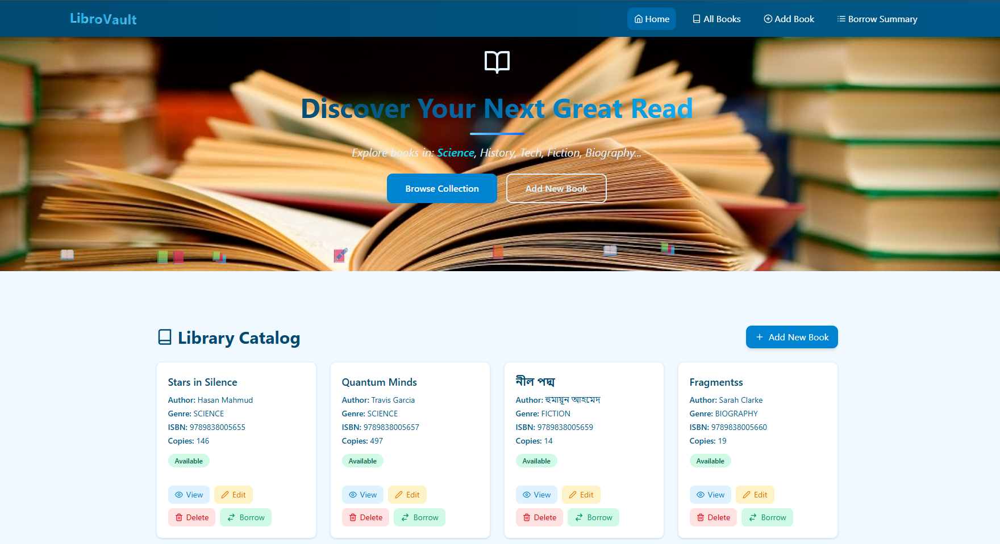
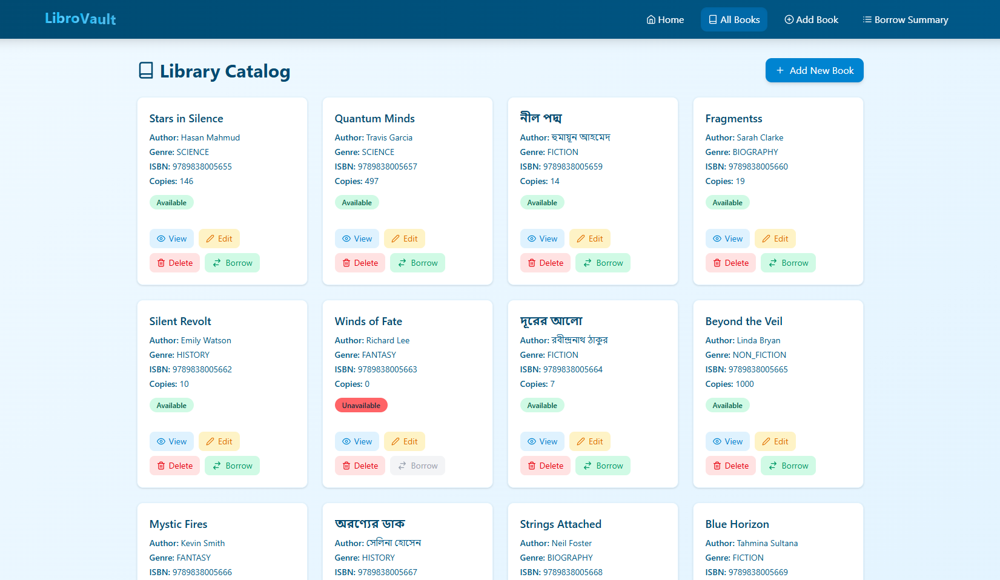
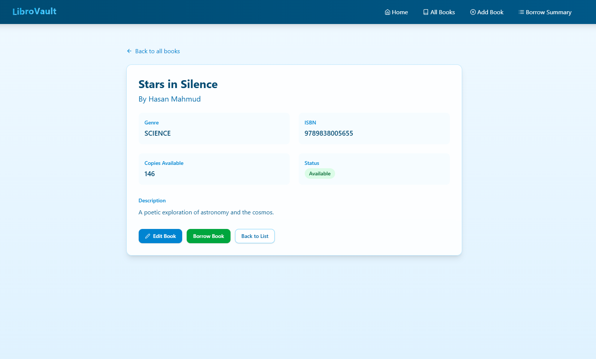
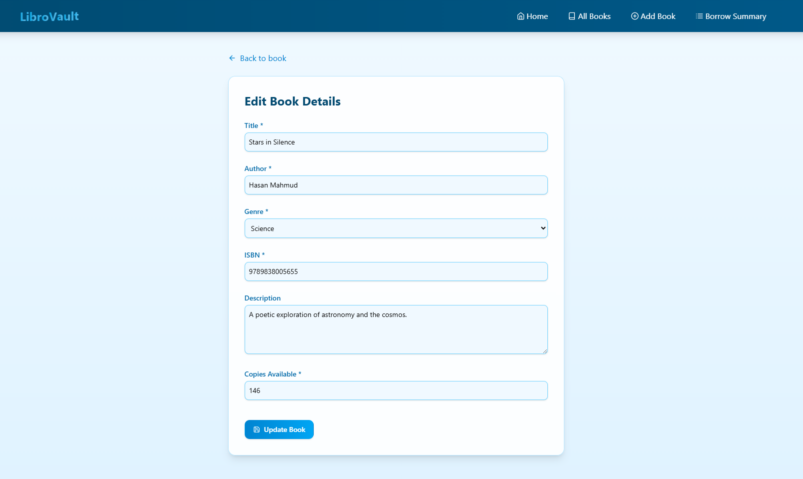
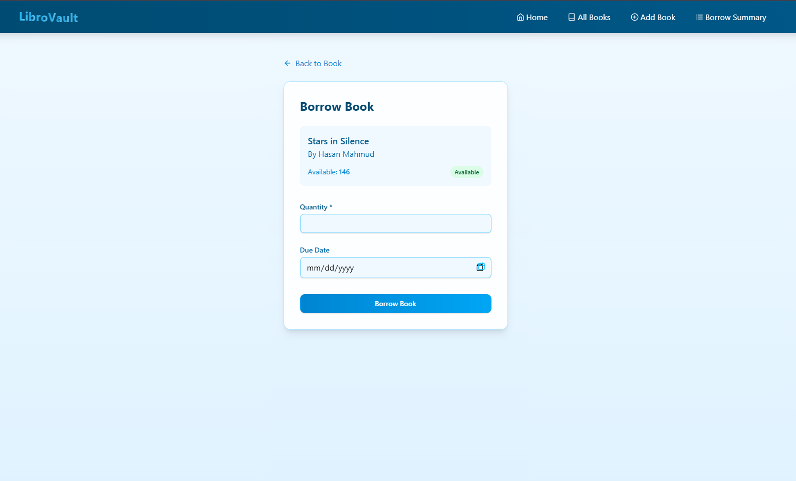
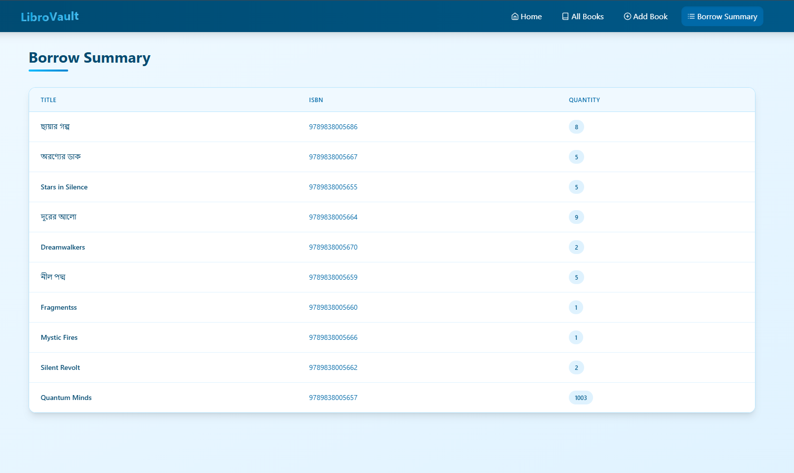

# 📚 LibroVault - Library Management System

A full-stack library management application with a React.js frontend and Express.js/TypeScript backend, featuring book catalog management and borrowing functionality.


## 🌟 Features

### 🖥️ Frontend (React + TypeScript)

- 🎨 **Modern UI** built with Tailwind CSS
- 📱 **Responsive Design** for all screen sizes
- 📚 **Book Management**
  - View all books with **pagination**
  - Add new books with **form validation**
  - Edit existing book details
  - Delete books with confirmation
- 🔄 **Borrowing System**
  - Borrow books with **quantity selection**
  - View **borrowing summary**
- 🏷️ **Category Filtering** to browse books by genre
- 💫 **Animations** with Framer Motion for smooth transitions
- 🔔 **Toast Notifications** for real-time user feedback
- 📦 **Redux Toolkit** for global state management
- 🔍 **RTK Query** for API data fetching and caching

---

### 🛠️ Backend (Express.js + TypeScript)

- 🔗 **RESTful API** endpoints for all core operations
- 🗃️ **MongoDB** database integration via Mongoose
- ✍️ **CRUD Operations** for book entities
- 📉 **Borrowing Logic** with live stock validation
- 📊 **Aggregation Pipelines** to summarize borrowed books
- ⚠️ **Robust Error Handling** with custom error responses
- 🔎 **Pagination, Filtering, and Sorting** for books
- 🔐 **Type Safety** enforced using TypeScript interfaces

## 🛠️ Technologies Used

**Frontend:**
| **Layer** | **Technology** |
| --- | --- |
| Frontend | React + TypeScript |
| State Management | Redux Toolkit + RTK Query |
| Backend | Node.js + Express.js |
| Database | MongoDB + Mongoose |
| Styling | Tailwind CSS or any basic CSS framework |

---

**Backend:**

| **Layer**           | **Technology**                 |
|---------------------|--------------------------------|
| Backend             | Node.js                        |
| Web Framework       | Express.js                     |
| TypeScript Support  | TypeScript                     |
| Database            | MongoDB                        |
| Object Modeling     | Mongoose                       |
| Validation          | Zod                            |
| Deployment Platform | Vercel                         |

## 📂 Project Structure

```
frontend/
├── public/
├── src/
│ ├── assets/
│ ├── components/
│ │ ├── layout/
│ │ │ └── Navbar.tsx
│ │ │ └── Footer.tsx
│ │ │ └── Hero.tsx
│ │ ├── ui/
│ │ │ └── button.tsx
│ ├── features/
│ │ └── books/
| |  └── booksApi.ts
│ │ └── borrow/
| |  └── borrowApi.ts
│ ├── home/
│ │ └── Home.tsx
│ ├── lib/
│ │ └── utils.ts
│ ├── pages/
│ │ └── AddBook.tsx
│ │ └── BookDetails.tsx
│ │ └── Books.tsx
│ │ └── Borrow.tsx
│ │ └── BorrowSummary.tsx
│ │ └── CategoryBooks.tsx
│ │ └── DeleteBook.tsx
│ │ └── EditBook.tsx
│ ├── redux/
│ │ └── hooks.ts
│ │ └── store.ts
│ ├── router/
│ │ └── index.tsx
│ └── App.tsx
│ └── App.css
│ └── index.tsx
│ └── main.tsx
├── index.css
├── package.json
├── tsconfig.json
└── vercel.json

src/
├── app/
│   ├── controllers
│   │   ├── book.controller.ts
│   │   └── borrow.controller.ts
│   ├── interfaces
│   │   ├── book.interfaces.ts
│   │   └── borrow.interface.ts
│   ├── models
│   │   ├── book.model.ts
│   │   └── borrow.model.ts
│   ├── utils
│   │   ├── apiFunctionality.ts
│   │   └── errorHandler.ts
│   ├── app.ts
│   └── server.ts
├── .env
├── package.json
├── tsconfig.json
└── vercel.json

```

## 🚀 Getting Started

### Installation

1. **Clone the repository**
   ```bash
   git clone https://github.com/reduanahmadswe/L2B5A3.git
   cd L2B5A3
   ```

2. **Install dependencies for both frontend and backend**
   ```bash
   # Frontend
   cd frontend
   npm install

   # Backend
   cd ../backend
   npm install
   ```

3. **Environment Setup**
   - Create `.env` files in both frontend and backend directories
   - Example backend `.env`:
     ```
     PORT=5000
     DATABASE_URL=mongodb://localhost:27017/librarymanagementapi
     ```
     > Replace `DATABASE_URL` with your MongoDB URI if using MongoDB Atlas.

4. **Run the applications**
   ```bash
   # Frontend
   cd frontend
   npm run dev

   # Backend
   cd ../backend
   npm run dev
   ```

## 🌍 Live Deployment

Frontend: [https://librovalt.vercel.app/](https://librovalt.vercel.app/)  
Backend API: [https://library-management-ten-beta.vercel.app/](https://library-management-ten-beta.vercel.app/)

---

## 📮 API Endpoints

### 🔹 Book Routes

| Method | Endpoint         | Description                         |
| ------ | ---------------- | ----------------------------------- |
| POST   | `/api/books`     | Create a new book                   |
| GET    | `/api/books`     | Get all books (filter, sort, limit) |
| GET    | `/api/books/:id` | Get a book by ID                    |
| PUT    | `/api/books/:id` | Update a book                       |
| DELETE | `/api/books/:id` | Delete a book                       |

### 🔹 Borrow Routes

| Method | Endpoint      | Description                          |
| ------ | ------------- | ------------------------------------ |
| POST   | `/api/borrow` | Borrow a book                        |
| GET    | `/api/borrow` | Borrowed books summary (aggregation) |

---

## 🧪 Sample Request: Create Book

**POST** `/api/books`

```json
{
  "title": "The Theory of Everything",
  "author": "Stephen Hawking",
  "genre": "SCIENCE",
  "isbn": "9780553380163",
  "description": "An overview of cosmology and black holes.",
  "copies": 5,
  "available": true
}
```

---

## 📊 Borrow Summary (Aggregation)

**GET** `/api/borrow`

**Response:**

```json
{
    "success": true,
    "message": "Borrowed books summary retrieved successfully",
    "data": [
        {
            "book": {
                "title": "The Selfish Gene",
                "isbn": "9780192860927"
            },
            "totalQuantity": 1
        },
        {
            "book": {
                "title": "The Mystery of the Universe",
                "isbn": "9789848001234"
            },
            "totalQuantity": 30
        },
        {
            "book": {
                "title": "Educated",
                "isbn": "9780399590504"
            },
            "totalQuantity": 1
        },
        {
            "book": {
                "title": "Thinking, Fast and Slow",
                "isbn": "9780374533557"
            },
            "totalQuantity": 1
        }
    ]
}
```

---

## ⚠️ Error Response Structure

```json
{
    "message": "Validation failed",
    "success": false,
    "error": {
        "name": "ValidationError",
        "errors": {
            "quantity": {
                "message": "Path `quantity` (-10) is less than minimum allowed value (1).",
                "name": "ValidatorError",
                "properties": {
                    "message": "Path `quantity` (-10) is less than minimum allowed value (1).",
                    "type": "min",
                    "min": 1
                },
                "kind": "min",
                "path": "quantity",
                "value": -10
            }
        }
    }
}
```

---
## 📸 Screenshots

### 🏠 Home Page
Featured books and categories  


### 📚 Books Catalog
Paginated list of all books  


### 📖 Book Details
Complete book information  


### ✏️ Add/Edit Book
Form for managing book data  


### 📦 Borrow Interface
Checkout system for books  


### 📊 Borrow Summary
Overview of borrowed books  



## 🙌 Author

**Reduan Ahmad**  
[GitHub](https://github.com/reduanahmadswe/)  
[Portfolio](https://reduanahmad.com)
